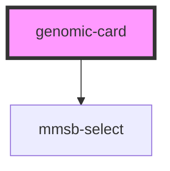

# genomic-card

<!-- Auto Generated Below -->

## Properties

| Property       | Attribute      | Description | Type     | Default     |
| -------------- | -------------- | ----------- | -------- | ----------- |
| `all_data`     | `all_data`     |             | `string` | `undefined` |
| `diagonal_svg` | `diagonal_svg` |             | `number` | `undefined` |
| `gene`         | `gene`         |             | `string` | `undefined` |
| `org_names`    | `org_names`    |             | `string` | `undefined` |
| `size`         | `size`         |             | `string` | `undefined` |

## Events

| Event             | Description | Type               |
| ----------------- | ----------- | ------------------ |
| `changeOrgCard`   |             | `CustomEvent<any>` |
| `changeRefCard`   |             | `CustomEvent<any>` |
| `changeSgrnaCard` |             | `CustomEvent<any>` |
| `sgDataSection`   |             | `CustomEvent<any>` |

## Dependencies

### Depends on

- mmsb-select

### Graph

----------------------------------------------

*Built with [StencilJS](https://stenciljs.com/)*
